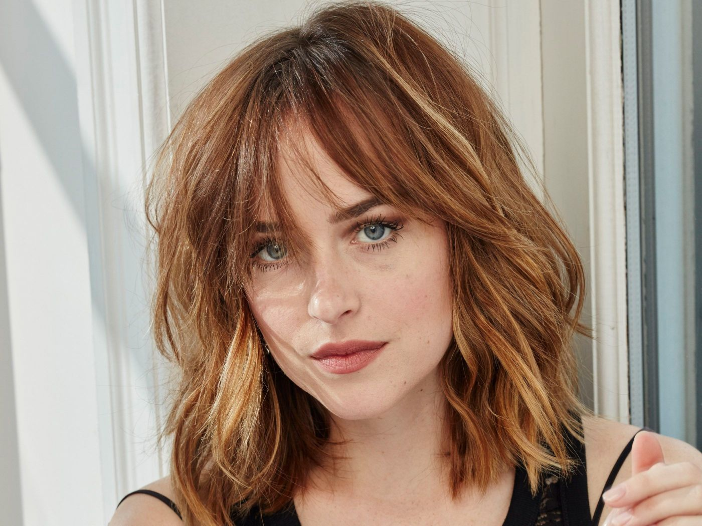
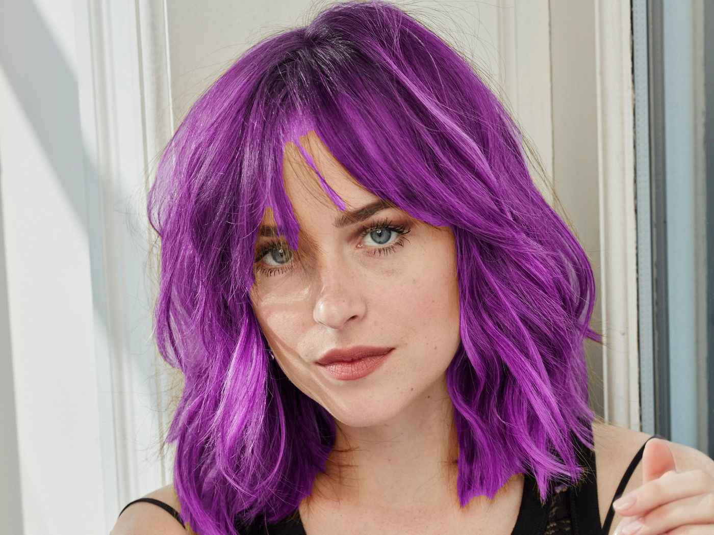
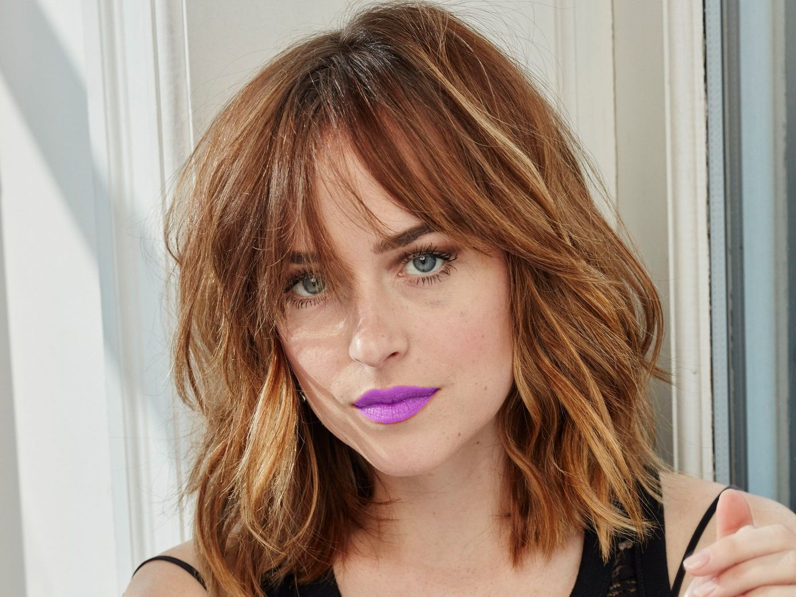

# Makeup Bot
## Telegram bot for **hair** and **lips** makeup
## Library
**Makeup bot** is based on a deep neural network model for semantic segmentation. 
To ensure good performance during inference, the model is available in the form of tensorflow lite model.

## Examples

